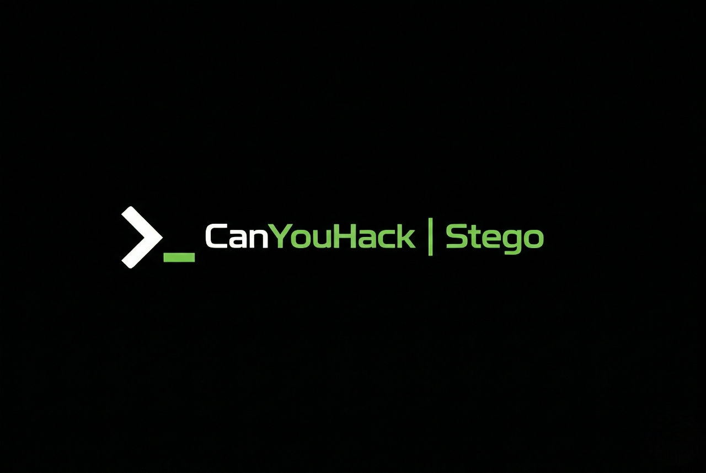

<p align="center">
  
</p>

<p align="center">
  <a href="https://github.com/canyouhack-org/cyh-steg-cli/stargazers"></a>
  <a href="https://github.com/canyouhack-org/cyh-steg-cli/blob/main/LICENSE"></a>
  <a href="https://github.com/canyouhack-org/cyh-steg-cli"></a>
  <a href="https://github.com/canyouhack-org/cyh-steg-cli"></a>
</p>

# CanYouHack Steg

A fast, professional CLI steganography analysis tool. Automatically detects file types and runs **17 steganography tools** concurrently with rich, color-coded terminal output.

## Why Use This?

Most steganography analysis requires opening multiple tools manually. CanYouHack Steg runs everything at once — image analysis, audio extraction, brute-force cracking, bitplane extraction — and gives you a clean report in seconds.

## Example Output

```
$ steg scan secret.png

  ╔══════════════════════════════════════════════════╗
  ║  📄 TARGET FILE                                   ║
  ╠══════════════════════════════════════════════════╣
  ║  File:       secret.png                           ║
  ║  MIME:       image/png                            ║
  ║  Size:       245.30 KB                            ║
  ║  Category:   PNG                                  ║
  ╚══════════════════════════════════════════════════╝

  🔍 Starting scan with 17 tools...

  ┌─── 🔧 GENERAL ANALYSIS ────────────────────────────
  │ ✓ file              (5ms)
  │   image/png; charset=binary
  │ ✓ exiftool          (120ms)
  │   File Type                       : PNG
  │   Image Width                     : 800
  │   Image Height                    : 600
  │   Bit Depth                       : 8
  │ ✓ binwalk           (25ms)
  │   0x0         PNG image, 800 x 600
  │   0x1A3F0     Zip archive data, compressed
  │ ✓ strings           (12ms)
  │   flag{hidden_in_plain_sight}

  ┌─── 🖼️  IMAGE STEGANOGRAPHY ───────────────────────
  │ ✓ zsteg             (180ms)
  │   b1,rgb,lsb,xy    .. text: "CTF{st3g_m4st3r}"
  │ ✓ steghide-extract  (35ms)
  │   wrote extracted data to output/steghide_extracted.txt
  │ ✓ steghide-info     (20ms)
  │   format: png image
  │   capacity: 12.5 KB
  │   embedded file: "secret.txt"
  │ ✓ stegsolve         (2.1s)
  │   Extracted 24 RGB bitplanes to output/stegsolve_planes/
  │ ✓ stegseek          (650ms)
  │   [i] Found passphrase: "password123"
  │   [i] Original filename: "flag.txt"

  ┌─── 🎵 AUDIO STEGANOGRAPHY ─────────────────────────
  │ ⊘ steghide-audio    skipped: not an audio file

  ┌─── 📝 TEXT / MISC STEGANOGRAPHY ────────────────────
  │ ✓ unicode-steg      (10ms)
  │   No zero-width Unicode steganography detected.
  │ ✓ spammimic         (8ms)
  │   No SpamMimic steganography patterns detected.

  ╔══════════════════════════════════════════════════╗
  ║  📊 SCAN SUMMARY                                  ║
  ╠══════════════════════════════════════════════════╣
  ║  📋 Total tools:      17                        ║
  ║  ✅ Successful:       15                         ║
  ║  📝 With output:      14                        ║
  ║  ❌ Failed:           0                          ║
  ║  ⊘  Skipped:          2                         ║
  ║  ⏱  Duration:         2.1s                      ║
  ╚══════════════════════════════════════════════════╝

  📁 Extracted files saved to: /tmp/steg-cli-output/
```

## Features

**Auto file detection** — Identifies PNG, JPG, BMP, GIF, TIFF, WEBP, WAV, MP3, FLAC, OGG, AU using magic bytes and MIME types.

**Concurrent scanning** — All applicable tools run in parallel with per-tool timeouts. A full scan typically finishes in under 2 seconds.

**Stegsolve bitplanes** — Extracts all 24 RGB bitplanes (Red 0-7, Green 0-7, Blue 0-7) and saves them as PNG images for visual analysis.

**Brute-force cracking** — Automatically downloads `rockyou.txt` and runs stegseek against supported formats.

**Unicode steganography detection** — Scans for zero-width characters (ZWSP, ZWNJ, ZWJ, BOM) hidden in text files.

**SpamMimic detection** — Identifies spam-encoded steganography patterns in text content.

**Auto dependency installer** — Detects your distro (Arch, Ubuntu/Debian, Fedora, openSUSE) and installs missing tools via the appropriate package manager, including AUR helpers.

## Integrated Tools

| Tool | Category | Formats | Description |
|------|----------|---------|-------------|
| `file` | General | All | MIME type detection |
| `exiftool` | General | All | Metadata extraction |
| `binwalk` | General | All | Embedded file detection |
| `foremost` | General | All | File carving |
| `strings` | General | All | Printable string extraction |
| `xxd` | General | All | Hex dump |
| `zsteg` | Image | PNG, BMP | LSB steganography |
| `steghide` | Image | JPG, BMP, WAV, AU | Password-based extraction |
| `pngcheck` | Image | PNG | PNG integrity check |
| `jsteg` | Image | JPG | JPEG steganography |
| `openstego` | Image | PNG | OpenStego extraction |
| `stegoveritas` | Image | All images | Advanced steganalysis |
| `stegseek` | Image | JPG, BMP | Brute-force cracker |
| `stegsolve` | Image | PNG, JPG, BMP | RGB bitplane extraction |
| `identify` | Image | All images | GraphicsMagick analysis |
| `sox` | Audio | WAV, MP3, FLAC, OGG | Spectrogram generation |
| `wavsteg` | Audio | WAV | LSB audio steganography |

## Installation

Clone the repository. A pre-built Linux binary is included.

```bash
git clone https://github.com/canyouhack-org/cyh-steg-cli
cd cyh-steg-cli
```

### Linux

Install the included binary system-wide:

```bash
sudo ./install.sh
```

Or build from source if you have Go installed:

```bash
go build -o steg ./
sudo cp steg /usr/local/bin/
```

### Install Steganography Tools

After installing the binary, fetch all underlying analysis tools:

```bash
steg install
```

Check which tools are available:

```bash
steg deps
```

## Usage

```bash
# Scan any file — type is detected automatically
steg scan image.png
steg scan audio.wav
steg scan document.txt

# Scan with a password hint
steg scan image.jpg -p "mysecret"

# Skip slow tools
steg scan image.png --skip stegoveritas,foremost

# Run only specific tools
steg scan image.jpg --only steghide,exiftool,zsteg

# Save extracted files to a custom directory
steg scan image.png -o ./my-output

# Check installed tools
steg deps

# Install all missing tools automatically
steg install
```

## Limitations

- AUR packages require `yay` or `paru` on Arch Linux
- Large images may take longer for bitplane extraction

## License

This project is licensed under the MIT License. See the [LICENSE](LICENSE) file for details.

## Contributing

Found a bug? Want to add another tool? Open an issue or submit a pull request on [GitHub](https://github.com/canyouhack-org/cyh-steg-cli).

---

<p align="center">
  Built by <a href="https://canyouhack.org">CanYouHack</a> — Start your cybersecurity journey with CTF challenges.
</p>
